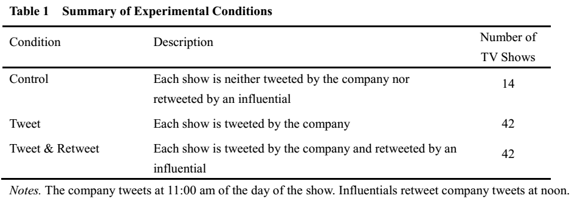
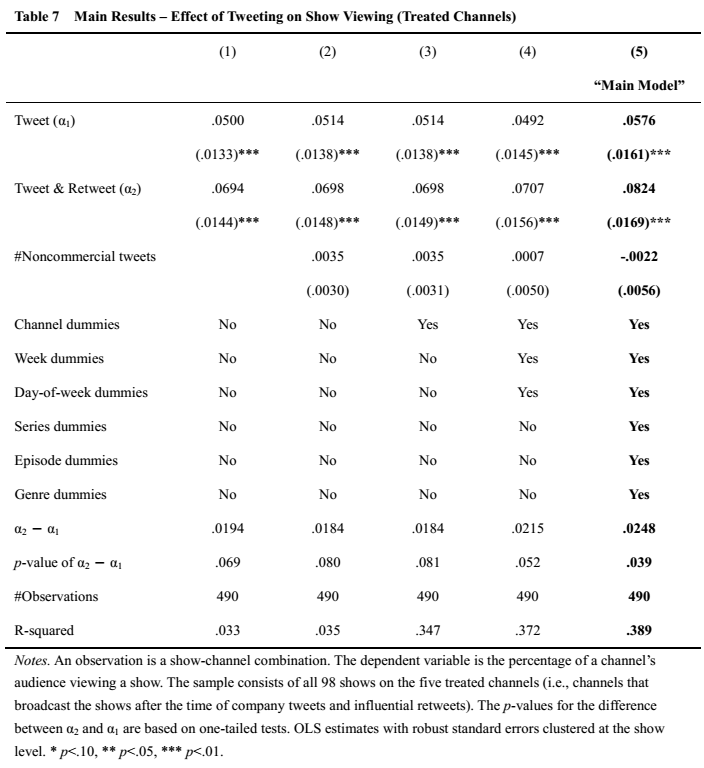
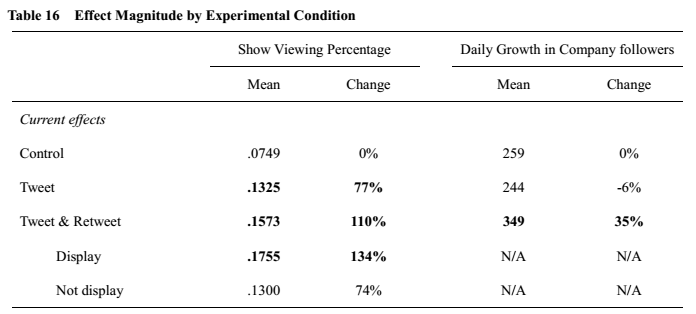
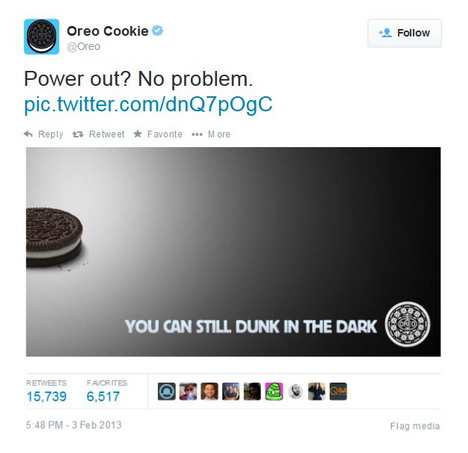
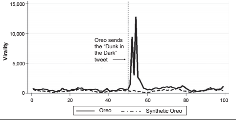
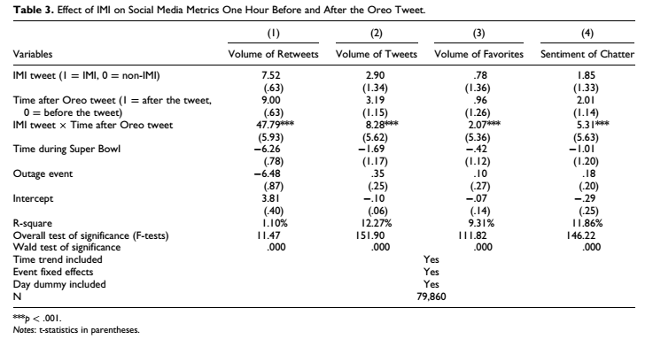
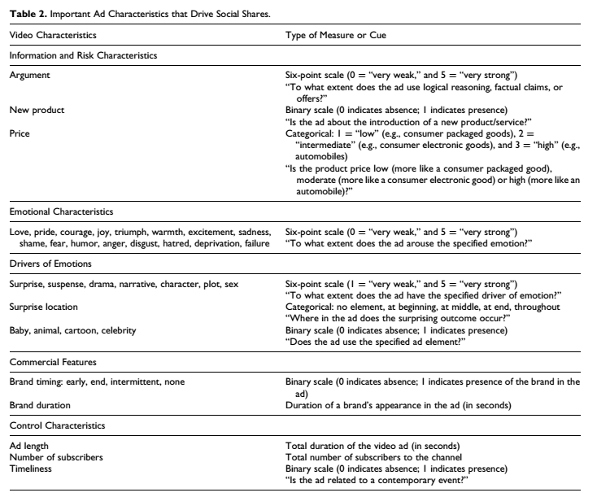
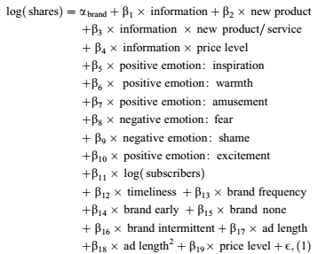
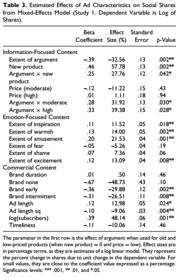
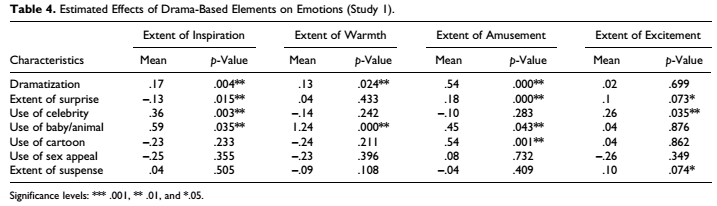

class: font160

# Learning Goals for this Week

* Discuss why company tweets may increase demand and summarize results from an experiment that tests the effectiveness of company tweets on demand for products
* Define Improvised Marketing Interventions (IMI) and assess aspects of an IMI that are important for its success
* Define the term "Viral Marketing"
* Identify features of an ad that consumers more likely share it
* Explain the tension between "viral-" and "valuable" marketing 
* Summarize the main features of "valuably viral" ads

---
class: inverse, center, middle

# Preliminaries

---
class: font160
# Where Are We Now? 

```{r, echo = FALSE, fig.align = "center", out.width="35%"}
url <- "figs/pngtree-pile-of-cartoonish-cute-doodle-theme-books-png-image_6871556.png"
knitr::include_graphics(url)
```

Course Themes:

1. `r icons:::icon_style(icons::fontawesome("check", style = "solid"), scale = 1)` Measuring Advertising Effects
2. **User Generated Content & Social Media**
  * `r icons:::icon_style(icons::fontawesome("check", style = "solid"), scale = 1)` Online Reviews
  * `r icons:::icon_style(icons::fontawesome("check", style = "solid"), scale = 1)` Word of Mouth & Influencers
  * `r icons:::icon_style(icons::fontawesome("bullseye", style = "solid"), scale = 1)` Firm Generated Content & Viral Marketing


---
class: font160
# Today's Topic Coverage

* Can firm generated content on social media increase product demand?
  * [Gong, Zhang, Zhao and Jiang (2017)](https://dspace.mit.edu/handle/1721.1/120756)


What helps ads go viral?

* [Moldovan, Steinhart & Lehmann (2019)](https://doi.org/10.1016/j.intmar.2019.02.004)

When is viral content valuable for firms?

* [Akpinar & Berger (2017)](https://doi.org/10.1509/jmr.13.0350)

---
class: inverse, center, middle
# Tweeting as a Marketing Tool

---
class: font160
# Do Firm Tweets Matter?

**Motivation**: Does tweeting increase demand for their products

**Specific Questions**:

* What is the causal effect of company tweets on demand?
* Do retweets by influential users help?

**How?**: Large scale experiment on Weibo w/ a media company

* Note: (again) This paper is **very** cool

---
class: font160
# The Experiment

Weibo $\approx$ Chinese Twitter

Industry: documentary TV shows 

* One show broadcast per day across seven local channels

```{r, echo = FALSE, fig.align = "center", out.width="100%"}

```

---
# Results

```{r, echo = FALSE, fig.align = "center", out.width="63%"}

```

---
# Results II 

```{r, echo = FALSE, fig.align = "center", out.width="100%"}

```

---
class: font150
# Main Takeaways

**Effects:**

* Tweeting: positive & significant effect
* Tweeting + Influential retweet: retweet gives a significant boost

**What's the mechanism?** (subtle)

* Influential tweets with broadcast time info attract new viewers
  *  Table 8 and 9
* Informative tweets (broadcast time) also attract new followers to company page


---
class: inverse, center, middle

# Improvised Marketing Interventions

---
class: font160
# Improvised Marketing Interventions

**Improvised Marketing Interventions (IMI)**: composition and execution of a real-time marketing communication
proximal to an external event

**Motivation**: Are IMI's effective at generating online sharing?

**Specific Questions**:

* Do IMI's result in greater virality?
* What type of IMI yields greater virality?
* Do IMIs enhance firm value?

**How?**: A mix of experiment, quasi-experiment and observational data

* We'll look at a subset of their results, focusing on the first two questions


---
# IMIs and Virality

**Context**: Superbowl blackout, 2013

```{r, echo = FALSE, fig.align = "center", out.width="65%"}

```

---
# Virality of Oreo Tweet

```{r, echo = FALSE, fig.align = "center", out.width="100%"}

```

---
# Virality of Oreo Tweet

```{r, echo = FALSE, fig.align = "center", out.width="100%"}

```

---
# Timeliness & Unanticipation

**Study 2**: mTurk Survey

```{r, echo = FALSE, fig.align = "center", out.width="30%", fig.show = 'hold', fig.ncol = 2}
knitr::include_graphics(c("figs/borah_timeliness.png", "figs/borah_anticipation.png"))
```


---
class: font160
# Marketing Implications

* IMI can help business connect with an audience weary of traditional advertising messages

* Humor and Timeliness important

* Keeping a close eye on trends and online chatter 
  * ... and being able to formulate a witty post/response

* Warning: Need to be careful that don't offend
  * Example: [Burger King on International Women's Day](https://globalnews.ca/news/7683800/burger-king-womens-day-kitchen-tweet/)

---
class: inverse, center, middle

# What helps ads go viral?

---
class: font160
# Viral Marketing

**Virality**: achieving a large number of views in a short time period due to consumers sharing content online. 


.center[
`r icons::fontawesome("question", style = "solid")` What do marketers and managers care about virality?
]


---
class: font160
# Viral Marketing

**Virality**: achieving a large number of views in a short time period due to consumers sharing content online. 


.center[
`r icons::fontawesome("question", style = "solid")` What do marketers and managers care about virality?
]

* Ability to reach vast audiences in a short period of time at low cost
* Increases brand visibility and recognition $\rightarrow$ brand equity 
* (Increase in sales?)

* Lurking differences: Seeded virality vs non-seeded virality

---
class: inverse, center, middle

# What Drives Virality?

---
class: font160
# What Drives Online Sharing?

**Motivation**: What characteristics of an ad enhance its shareability? 

**Specific Questions**:

* Does information focussed content limit sharing?
* Does brand prominence decrease sharing?
* Do positive emotions increase sharing?

**How?**: Online video ads on YouTube

* Note: Paper is descriptive / predictive rather than causal

---
class: font160
# YouTube Advertising Data

All video ads between Nov 25, 2013 and March 4, 2014

* Approx 1,962 video ads

Info they get via Youtube's API:

* Shares on Facebook, Twitter, Google +, LinkedIn over first 30 days

Info about Ads: sample of 360 of ads collected, covers 79 brands

* Got coders (i.e. paid some people) to watch ads and write down whats in it


---
# Ad Characteristics

```{r, echo = FALSE, fig.align = "center", out.width="80%"}

```


---
class: font140
# Regression Equation

```{r, echo = FALSE, fig.align = "center", out.width="55%"}

```


Note: Think of this as a **descriptive** regression 

* They'll also use it for prediction on an (unseen) sample
* "Are these features predictive of shares?"  
  * My Q: If they really want to predict though, why not go machine learning route?

---
# Estimation Results

```{r, echo = FALSE, fig.align = "center", out.width="45%"}

```


---
class: font140
# Main Findings in Regression

* Information decreases shares
  * But not for a new products
  * And less for high price products

* Positive emotions lead to more shares
  * High arousal emotions not more effective than low arousal

* Timing of brand appearence and length of ad matters

**A critical eye**: They are cutting the data many ways for only 346 observations!

(Paper also discusses predictive power of model)

---
# Dramatic Elements and Emotions

```{r, echo = FALSE, fig.align = "center", out.width="100%"}

```


---
class: font160
# Marketing Implications

Drivers of sharing important to understand to help ads get shared

* This sounds *a little too causal*
* ... as will a lot of their implications

The authors want us to believe:

* Less information
* More positive emotions 
* More careful brand placement

are important to promote online sharing


---
class: inverse, center, middle

# When is viral content valuable for firms?

---
class: font160
# Motivation 

**Strategic Question**: Can a firm create shareable ads that benefit brands?

i.e. ads that are

* Viral: highly shared, and 
* Valuable: impact KPIs of interest

**Why relevant?** 

* Rush for highly shareable ad content ...
* At the expense of advertising effectiveness 

.center["*Content aspects that increase sharing seem to decrease effectiveness*"]

* Competing effects of informational vs emotional appeals

---
class: font150
# Flow of the Paper: Lab Studies 

Multiple studies $\rightarrow$ "Typical" consumer behaviour style paper

**Study 0** Examine sharing of online video ads

* Do certain types of ads generate more virality in "real" data?

**Study 1**: Experiment to test ad type on shares and brand outcomes

**Study 2**: Enriches Study 1 to ...

* Rule out alternative explanations 
* Test external validity

**Study 3**: Investigate mechanisms behind the effect

---
class: font150
# Field Observation of Viral Ads 

Data: Unruly.co 

* Prominent viral ad tracking platform

Time: June 2003  

Outcome: Number of shares in 6 months after launch 

Covariates: 

* Informative vs Emotional on a 7 point scale 
* Integral-ness of brand to narrative

---
class: font150
# Field Observation: Findings 

* Trade off emotional ads vs brand integralness

```{r, echo = FALSE, fig.align = "center", out.width="40%"}
url <- "figs/vv_fig1.png"
knitr::include_graphics(url)
```

* Emotional ads are shared more than informative ads

* Informative ads are shared more when brand integral to narrative 
* Brand integral-ness not important in adds that emphasize emotional appeal

---
class: font150
# Study 1: Setup


```{r, echo = FALSE, fig.align = "center", out.width="70%"}
url <- "figs/vv_study1_stimuli.png"
knitr::include_graphics(url)
```

Lab Experiment: Undergrads @ Wharton

* Randomly assigned an ad, then asked 
  1. Willingness to share 
  2. Brand Evaluation 
  3. Purchase Likelihood

---
class: font150
# Study 1: Results


```{r, echo = FALSE, fig.align = "center", out.width="60%"}
url <- "figs/vv_study1_results.png"
knitr::include_graphics(url)
```

.center[Emotional integral "best of both worlds"]

---
class: font150
# Study 2: Setup


```{r, echo = FALSE, fig.align = "center", out.width="60%"}
url <- "figs/vv_study2_stimuli.png"
knitr::include_graphics(url)
```

Lab Experiment: Undergrads @ MEF

---
# Study 2: Results


```{r, echo = FALSE, fig.align = "center", out.width="70%"}
url <- "figs/vv_study2_results.png"
knitr::include_graphics(url)
```

---
class: font150
# Study 3

Same as Study 2, but 

* at Erasmus U
* Suggests mechanisms driving main effects  

Main results: 


```{r, echo = FALSE, fig.align = "center", out.width="50%"}
url <- "figs/vv_study3_results_main.png"
knitr::include_graphics(url)
```

---
# Study 3: Mechanisms


```{r, echo = FALSE, fig.align = "center", out.width="60%"}
url <- "figs/vv_study3_results_mediation.png"
knitr::include_graphics(url)
```

---
class: font150
# Takeaways

* Emotional ads increase sharing 
* Informative ads increase brand evaluation and purchase intention 
* Emotional (brand) Integral ads combine both effects 
  * This is the "valuable virality" the authors care about
  * They argue  this is by:
    * (a) creating positive inferences about persuasion, and 
    * (b) increasing brand knowledge 
  * (... but I can't see a competing story being thoroughly tested) 


---
class: inverse, center, middle

# Recap 

---
class: font160
# Summary 

* Company tweets (these are ads) can generate demand, influential retweets even more
  * mechanism: attracting a new audience 

* Improvised Marketing Interventions are heavily shared when they are timely and involve humor and aren't anticipated

* Features of ads that are associated with increased virality:
  * Feature positive emotions
  * Are less informative
    * There are exceptions here - new products, expensive products
  * Careful placement of brand name

* **Trade off** between **shareability** and **KPI performance** of ads 
  * "Valuably Viral" ads use emotion and branding to try and balance shareability and performance 


---
# License & Citation

Suggested Citation:

```{r, engine='out', eval = FALSE}
@misc{deerdsms2023,
      title={"Digital and Social Media Strategies: Firm Generated Content 
          & Viral Marketing"},
      author={Lachlan Deer},
      year={2023},
      url = "https://github.com/deer-marketing-lab/dsms-lecture-fgc-virality"
}
```

<p style="text-align:center;"></p>

This course adheres to the principles of the Open Science Community of Tilburg University. 
This initiative advocates for transparency and accessibility in research and teaching to all levels of society and thus creating more accountability and impact.

<p style="text-align:center;"></p>
This work is licensed under a <a rel="license" href="http://creativecommons.org/licenses/by-sa/4.0/">Creative Commons Attribution-ShareAlike 4.0 International License</a>.